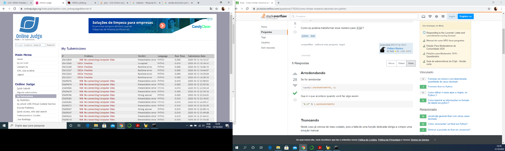

# Trabalho de Programação -- Algoritmos Gulosos -- Parte 4
**Autor:** Edimar Antonio da Cruz
**Data:** 13 de outubro de 2020
**Problema:** 10034  --  Freckles
## Sobre a Soluçãoo
Este diretório contém o código fonte gerado para solucionar o problema 10034
do *Online Judge*. O problema recebeu veredito \Accepted", como mostrado na
figura abaixo:

O programa foi desenvolvido em Python
